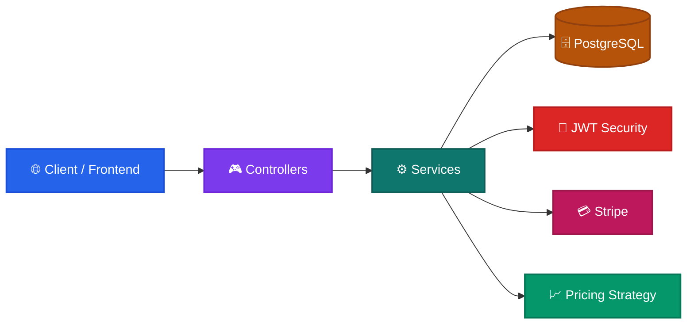

# 🏨 Roomly — Hotel Booking & Management Backend

A modern Spring Boot backend for a premium hotel booking platform with secure authentication, room inventory management, dynamic pricing, guest handling, and Stripe-powered payments.

---

## ✨ Overview

This project is a full-featured backend for a hotel booking ecosystem. It supports guest and manager flows, secure API access, booking orchestration, room inventory control, and payment processing through Stripe.

---

## 🚀 Key Features

- 🔐 Role-based authentication for guests and hotel managers
- 🏡 Hotel discovery, property management, and booking workflows
- 📦 Inventory and room-level management
- 💰 Dynamic pricing strategies for holidays, weekends, and demand surges
- 🧾 Stripe payment intent and webhook support
- 📚 Swagger/OpenAPI documentation
- 🛡️ Centralized exception handling and structured API responses

---

## 🏗️ System Architecture



```text
┌───────────────────────────────┐
│ 🌐 Client / Frontend          │
└───────────────┬───────────────┘
                │ HTTPS
                ▼
┌───────────────────────────────┐
│ 🎮 Controllers / REST API     │
│ Auth • Hotel • Booking • User│
└───────────────┬───────────────┘
                │
                ▼
┌───────────────────────────────┐
│ ⚙️ Services & Business Logic │
│ Pricing • Inventory • Auth   │
└───────┬──────────────┬────────┘
        │              │
        ▼              ▼
┌──────────────────┐  ┌──────────────────┐
│ 🗄️ PostgreSQL    │  │ 💳 Stripe / Webhooks │
└──────────────────┘  └──────────────────┘
```

---

## 🛠️ Tech Stack

- Java 21
- Spring Boot 4.x
- Spring Web MVC
- Spring Security + JWT
- Spring Data JPA / Hibernate
- PostgreSQL
- Stripe Java SDK
- Lombok + ModelMapper
- Springdoc OpenAPI / Swagger UI

---

## 📁 Project Structure

```text
src/
├── main/
│   ├── java/com/aman/project/airBnbApp/
│   │   ├── advice/          # Global exception and response handling
│   │   ├── config/          # Swagger, mapper, Stripe, and app config
│   │   ├── controller/      # REST controllers for auth, hotels, bookings, users
│   │   ├── dto/             # Request/response DTOs
│   │   ├── entity/          # JPA entities and enums
│   │   ├── repository/      # Database access layer
│   │   ├── security/        # JWT auth, filters, and security helpers
│   │   ├── service/         # Business logic layer
│   │   └── strategy/        # Pricing strategies
│   └── resources/
│       ├── application.properties
│       └── application-prod.properties
└── test/java/               # Test suite
```

---

## 🚀 Getting Started

### Prerequisites

- Java 21+
- Maven
- PostgreSQL running locally

### 1) Configure the database

Update the settings in [src/main/resources/application.properties](src/main/resources/application.properties):

```properties
spring.datasource.url=jdbc:postgresql://localhost:5432/airBnb
spring.datasource.username=postgres
spring.datasource.password=password
```

### 2) Run the application

```bash
./mvnw clean compile
./mvnw spring-boot:run
```

The backend will start on:

- Port: 9091
- Base API path: /api/v1

### 3) Explore the API

Swagger UI is available at:

- http://localhost:9091/api/v1/swagger-ui/index.html

---

## ⚙️ Important Notes

- JWT-based authentication is configured in [src/main/resources/application.properties](src/main/resources/application.properties).
- Stripe keys can be supplied through environment variables when available.
- For production, secrets should be stored securely and database settings should be reviewed carefully.

---

## 🔗 Useful References

- Frontend integration guidance: [FRONTEND_helper.md](FRONTEND_helper.md)
- API and enum notes: [HELP.md](HELP.md)

If you want, the next step can be to add endpoint examples, sample payloads, or a contributor section.
